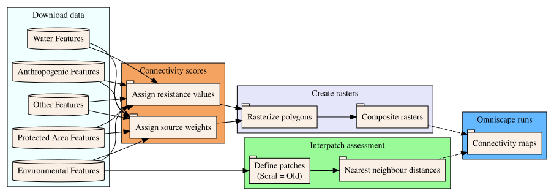

This repository contains code to produce a connectivity map for the intactness of old forests to inform biodiversity management for the Quesnel Natural Resource District (NRD).
This connectivity case study is part of Phase 3 of an Ecological Corridors project led by Travis Heckford,
to develop analytical tools for practitioners to implement Connectivity, Corridors, and Functional Ecological Networks (C-C-FEN).

**Authors and contributors:**

- Alex Chubaty (<achubaty@for-cast.ca>);
- Travis Heckford (<Travis.Heckford@gov.bc.ca>);
- Cole Wiltse;

# Overview

Relevant feature layers were compiled to build a database of shapefiles for circuit theory–based connectivity modelling [e.g., @McRae:2008; @McRae:2016] using [Omniscape](https://github.com/Circuitscape/Omniscape.jl) [@Landau:2021].

After originally following a human disturbance-based connectivity modelling approach [@McRae:2016], the decision to switch to a biodiversity emphasis for modelling was made to better distinguish the ecological values of forest ages.

## Data sources

The `R` programming language and environment for statistical computing [@RCore:2025] was used for compiling spatial data, using the [`bcdata`](https://github.com/bcgov/bcdata) [@Teucher:2021] and [`bcmaps`](https://github.com/bcgov/bcmaps) [@Teucher:2024] packages wherever possible; manual downloads were used as needed from government repositories.

The script downloads the following feature layers: 

1. Protected area features (Old Growth Management Areas, BC Parks/Ecological Reserves, Mule Deer Winter Range Zones, Wildlife Habitat Areas, High Value Moose Wetlands);

2. Water features (lakes, wetlands, rivers, stream networks);

3. Anthropogenic features (human disturbance, highways, roads, railway, resource roads);

4. Environmental features (Vegetation Resource Inventory, burn severity, forest disturbances, Biogeoclimatic Ecosystem Classifications);

5. Other (landscape units, land cover, Digital Elevation Model (DEM)). 

All vector data layers were projected to a common CRS and clipped to a boundary of the Quesnel NRD using the `sf` package [@Pebesma:2018; @Pebesma:2023].

## Landscape resistance scores

Data layers with associated variables and attributes were compiled into a spreadsheet to organize the downloaded feature data. 

A column detailing data treatment for Omniscape was created, including resistance/source weights rationales, if/how the data was buffered, or if/how the data was filtered). 

Columns were created for the assignment of resistance and source weight values; where possible, justifications were recorded and used from peer-reviewed landscape connectivity studies. 

## Moving window size

An interpatch assessment for the study area was conducted in `R` to inform the buffer size of data and the moving window radii required for Omniscape. 

R scripts were developed to calculate patch area (`ha`) and centroid-to-nearest-neighbour distances (`km`) for Old Growth Management Areas (OGMAs), protected areas, and high-value wildlife habitat features.

Summary statistics (`min`, `mean`, `max`) were calculated for three scenarios: 

- OGMAs only;
- OGMAs + BC Parks/Ecological Reserves;
- All protected features combined (OMGAs, BC Parks, Wildlife Habitat Areas (WHAs); including Mule Deer Winter Ranges and High Value Moose Wetlands). 

Stratified interpatch assessments where protected area polygon distances were based where their centroid fell within were also performed by grouping features according to:
- Landscape Units;
- BEC Zones;
- Natural Disturbance Types (NDTs);
- NDTs and BEC Zones.

Similarly, we performed edge-to-edge Nearest Neighbour distances for protected features in order to compare the values with the centroid analyses.

## Static barriers for intact forest resistance

<!-- TODO -->
- *in progress*

## Connectivity modelling

### Data prepration

R scripts were developed to generate composite resistance and source weight rasters using the feature layers compiled in the previous steps:

- The resistance values range from 1 to 1000 (low value = high biodiversity) ;
- The source weight values range from 0 to 1 (low value = no habitat potential). 

Rasterization was performed at a 30 m spatial resolution, aligned with the BC land cover base raster, and prepared using the `terra` package [@Hijmans:2025]. 
Feature layers were converted from shapefiles into a resistance raster and a source weight raster.

**Forest Age Classification:**

Projected stand age after significant disturbances (SIFA) from the Forest Disturbance layer was joined with VRI (dominant species) and BEC-NDT (Natural Disturbance Type and BEC Zone) layers. 

Each polygon was assigned a seral stage using thresholds from the Biodiversity Guidebook, and corresponding resistance and source weight values were applied (e.g., early forest = high resistance, old forest = low resistance). 

**Secondary Biodiversity Features:**

Wildlife Habitat Areas, Mule Deer Winter Range Zones, High Value Moose Wetlands, and general wetlands were assigned moderate resistance (250) and source weight (0.75), reflecting secondary biodiversity potential. 

**Primary Biodiversity Features:**

OGMAs and BC Parks/Ecological Reserves were assigned the lowest resistance (1) and highest source weight (1) reflecting optimal biodiversity potential.

**Linear Disturbance Features:**

A consolidated roads layer for the Cariboo region was merged with a provincial railways layer. 

Resistance and source weights were applied using tiered values based on road class, tenure, and usage intensity, with buffers being applied (25–250 m) representing a negative impact on biodiversity. 

**Water Features:**

Lakes, rivers, and streams were assigned high resistance and low source weight, reflecting barriers to biodiversity for most terrestrial species. 

Stream resistance values varied by stream order, and streams were buffered by order; S2 and S3 stream buffers were exaggerated to ensure presence in the 30 m raster. 

----

To create a composite resistance raster, all feature layer resistance rasters were combined using the following stacking rules: 

- OGMAs override all other features (lowest resistance);

- Old forest areas reduce the resistance of secondary biodiversity features;

- Roads and water features can only increase resistance, not decrease it;

- Final composite raster was reclassified to avoid 0 values (set to 1) and fill NA values as high resistance (1000).

To create a composite source weight raster used inverse logic, all feature layer source weight rasters were combined using the following stacking rules: 

- OGMAs override all (highest weight);

- Old forest area increase the source weight of overlapping secondary features;

- Roads and water features can only reduce source weight, never increase it;

- NA values were replaced with 0 to ensure compatibility with Omniscape. 

### Omniscape runs

Used Omniscape to produce connectivity maps.

**NOTE:** Omniscape not working with Julia 1.12; use 1.11 for now.
  <https://github.com/Circuitscape/Omniscape.jl/issues/160>

# Using this repository

## Getting the code

```bash
git clone https://github.com/FOR-CAST/bc-connectivity
```

## Software environment

### R 4.5.2

Install `rig` to manage R installations:

```shell
## Windows
winget install posit.rig

## macOS
brew tap r-lib/rig
brew install --cask rig

## Ubuntu Linux
`which sudo` curl -L https://rig.r-pkg.org/deb/rig.gpg -o /etc/apt/trusted.gpg.d/rig.gpg
`which sudo` sh -c 'echo "deb http://rig.r-pkg.org/deb rig main" > /etc/apt/sources.list.d/rig.list'
`which sudo` apt update
`which sudo` apt install r-rig
```

Install R 4.5.2:

```shell
rig add 4.5.2
```

### R packages

```r
renv::restore()
```

### Julia 1.11.7

Install `juliaup` to manage Julia installations:

```shell
## Windows
winget install --name Julia --id 9NJNWW8PVKMN -e -s msstore

## macOS
brew install juliaup

## Linux
curl -fsSL https://install.julialang.org | sh
```

Install Julia 1.11.7:

```shell
juliaup add 1.11.7
```

### Julia packages

Will automatically be installed on first run of the Julia code.

## Directory structure


``` r
fs::dir_tree(".", recurse = FALSE, regexp = "[^Teams]") 
```

```
## .
## ├── Data
## ├── Omniscape
## ├── Outputs
## ├── R
## ├── README.Rmd
## ├── README.html
## ├── README.md
## ├── TODO.md
## ├── air.toml
## ├── bc-connectivity.Rproj
## ├── citations
## ├── renv
## ├── renv.lock
## ├── scripts
## └── workflow.png
```

## Workflow




# References

<!-- references automatically generated from references.bib -->
