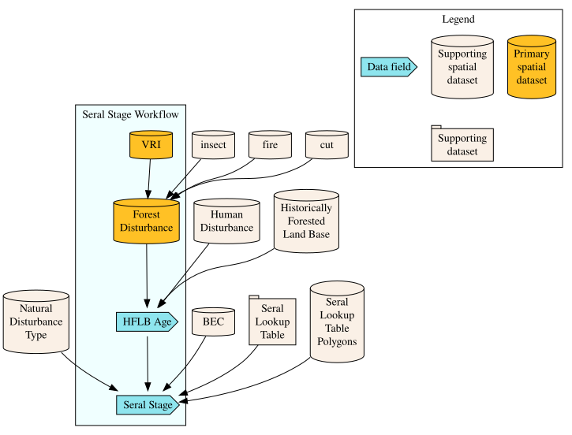
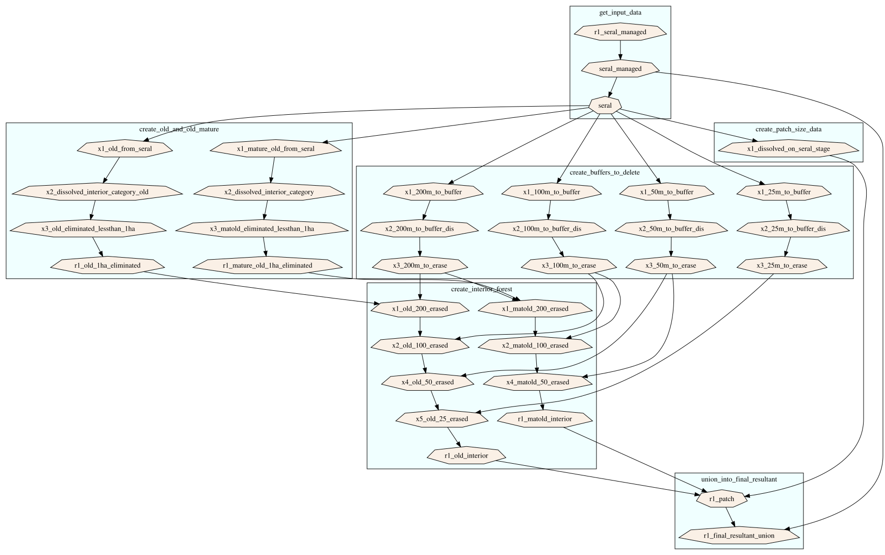

This repository contains code to produce a connectivity map for the intactness of old forests to inform biodiversity management for the Quesnel Natural Resource District (NRD).
This connectivity case study is part of Phase 3 of an Ecological Corridors project led by Travis Heckford,
to develop analytical tools for practitioners to implement Connectivity, Corridors, and Functional Ecological Networks (C-C-FEN).

**Authors and contributors:**

- Alex Chubaty (<achubaty@for-cast.ca>);
- Travis Heckford (<Travis.Heckford@gov.bc.ca>);
- Cole Wiltse;

# Overview

Relevant feature layers were compiled to build a database of shapefiles for circuit theory–based connectivity modelling [e.g., @McRae:2008; @McRae:2016] using [Omniscape](https://github.com/Circuitscape/Omniscape.jl) [@Landau:2021].

After originally following a human disturbance-based connectivity modelling approach [@McRae:2016], the decision to switch to a biodiversity emphasis for modelling was made to better distinguish the ecological values of forest ages.

## Workflow

This project uses a [`targets`](https://docs.ropensci.org/targets/) workflow.

```r
## Run the workflow:
## NOTE: callr/sf interaction causes multithread deadlock
targets::tar_make(callr_function = NULL)

## Visualize the target dependencies:
targets::tar_visnetwork()
```

### Debugging

See <https://books.ropensci.org/targets/debugging.html> for help.

```r
## Run the workflow verbosely
tar_make(callr_function = NULL, reporter = "verbose")
```


### Directory structure


```
## .
## ├── _dependencies.R
## ├── _targets.R
## ├── .github
## ├── .gitignore
## ├── .Rprofile
## ├── .vscode
## ├── air.toml
## ├── bc-connectivity.Rproj
## ├── CITATION.cff
## ├── citations
## ├── docker
## ├── INFO.md
## ├── LICENSE.md
## ├── Omniscape
## ├── R
## ├── README.md
## ├── README.Rmd
## ├── renv
## ├── renv.lock
## ├── scripts
## ├── workflow_patches.png
## ├── workflow_seral.png
## ├── workflow_summary.png
## └── workflow.png
```

Directories created locally when the workflow runs -- `Data/`, `Outputs/`, `Teams/`, and
`_targets/` -- are not tracked in git and so are not listed above.
See [Data access](#data-access) for how to populate `Data/`.

## Data sources

The `R` programming language and environment for statistical computing [@RCore:2025] was used for compiling spatial data, using the [`bcdata`](https://github.com/bcgov/bcdata) [@Teucher:2021] and [`bcmaps`](https://github.com/bcgov/bcmaps) [@Teucher:2024] packages wherever possible; manual downloads were used as needed from government repositories.

All vector data layers were projected to a common CRS and clipped to a boundary of the Quesnel NRD using the `sf` package [@Pebesma:2018; @Pebesma:2023].

**Planning Area Boundaries:**

- Landscape Units of British Columbia [&#x1F517;](https://catalogue.data.gov.bc.ca/dataset/11277e35-d8be-47e4-bb1f-c38e393179c6>);

- Natural Resource District Boundaries [&#x1F517;](https://catalogue.data.gov.bc.ca/dataset/0bc73892-e41f-41d0-8d8e-828c16139337/resource/2d9d0a5c-bdf7-47e8-9038-103a93e6205a);

**Landcover:**

- Land Cover of Canada (2020) [&#x1F517;](https://open.canada.ca/data/en/dataset/ee1580ab-a23d-4f86-a09b-79763677eb47/resource/f1ba2faa-ff10-4526-815a-c57b99eef1bb);

**Digital Elevation Model:**

- Canadian Digital Elevation Model (CDED) via the [`bcmaps`](https://github.com/bcgov/bcmaps) package [@Teucher:2024];

**Environmental Features:**

- BC Cumulative Effects Framework Forest Disturbance (2024) -- **not publicly distributed**; see [Data access](#data-access);

- Biogeoclimatic Ecosystem Classification (BEC) Zone/Subzone/Variant/Phase map (version 12, September 2, 2021) [&#x1F517;](https://catalogue.data.gov.bc.ca/dataset/f358a53b-ffde-4830-a325-a5a03ff672c3);

- Leading Group for the Cariboo Region [&#x1F517;](https://catalogue.data.gov.bc.ca/dataset/leading-group-for-the-cariboo-region);

- Vegetation Resource Inventory (VRI) Forest Vegetation Composite Rank 1 Layer (R1) (2024) [&#x1F517;](https://catalogue.data.gov.bc.ca/dataset/2ebb35d8-c82f-4a17-9c96-612ac3532d55);

**Primary Biodiversity Features:**

- BC Parks, Ecological Reserves, and Protected Areas [&#x1F517;](https://catalogue.data.gov.bc.ca/dataset/1130248f-f1a3-4956-8b2e-38d29d3e4af7);

- Old Growth Management Areas (OGMAs) [&#x1F517;](https://catalogue.data.gov.bc.ca/dataset/1b30f3bd-0ad0-4128-916b-66c6dd91dea4);

**Secondary Biodiversity Features:**

- High Value Moose Wetlands (HVMW) from Cariboo Chilcotin Land Use Plan [&#x1F517;](https://catalogue.data.gov.bc.ca/dataset/2c02040c-d7c5-4960-8d04-dea01d6d3e9f);

- Mule Deer Winter Range Habitat Management Zones - Cariboo Region [&#x1F517;](https://catalogue.data.gov.bc.ca/dataset/a60d7b6e-88b2-4105-95e2-aaf6cc3468cf);

- Freshwater Atlas Wetlands [&#x1F517;](https://catalogue.data.gov.bc.ca/dataset/93b413d8-1840-4770-9629-641d74bd1cc6);

- Wildlife Habitat Areas (WHAs) [&#x1F517;](https://catalogue.data.gov.bc.ca/dataset/b19ff409-ef71-4476-924e-b3bcf26a0127);

**Water Features:**

- Freshwater Atlas Lakes [&#x1F517;](https://catalogue.data.gov.bc.ca/dataset/cb1e3aba-d3fe-4de1-a2d4-b8b6650fb1f6);

- Freshwater Atlas Rivers [&#x1F517;](https://catalogue.data.gov.bc.ca/dataset/f7dac054-efbf-402f-ab62-6fc4b32a619e);

- Freshwater Atlas Stream Network [&#x1F517;](https://catalogue.data.gov.bc.ca/dataset/92344413-8035-4c08-b996-65a9b3f62fca);

**Anthropogenic Disturbance Features:**

<!-- TODO: Human Disturbance currently not used -->
- BC Cumulative Effects Framework Human Disturbance (2023) [&#x1F517;](https://catalogue.data.gov.bc.ca/dataset/bc-cumulative-effects-framework-human-disturbance-current);

- Cariboo Consolidated Roads [&#x1F517;](https://catalogue.data.gov.bc.ca/dataset/cariboo-consolidated-roads);

- Railway Track Lines [&#x1F517;](https://catalogue.data.gov.bc.ca/dataset/4ff93cda-9f58-4055-a372-98c22d04a9f8);

## Data access

No input data are distributed with this repository. The `Data/` directory is created
locally when the workflow runs.

**Publicly available layers.** Everything listed above except the Forest Disturbance layer
downloads automatically as part of the `targets` workflow, via the
[`bcdata`](https://github.com/bcgov/bcdata) and [`bcmaps`](https://github.com/bcgov/bcmaps)
packages or by direct download from the BC Data Catalogue and Open Government Portal.
No account, API key, or credential is required.

**Restricted layer.** The **BC Cumulative Effects Framework Forest Disturbance (2024)**
layer (`BC_CEF_Forest_Disturbance_2024.gdb`) is a CEF Custom Product. It is not available
through the `bcdata` package or the BC Data Catalogue, and it is not redistributed here.
The workflow will stop with an error if it is missing.

To request access, contact the project data steward:

- **Travis Heckford**, Government of British Columbia -- <Travis.Heckford@gov.bc.ca>

Please describe your intended use when requesting the data. Once obtained, place the
geodatabase in the workflow's download directory so that the following path resolves:

```
Data/download/BC_CEF_Forest_Disturbance_2024.gdb
```

The workflow will then proceed normally. Note that the Forest Disturbance layer drives the
Simple Inferred Forest Age (SIFA) and seral stage calculations, so the connectivity results
cannot be reproduced without it.

## Data licence and attribution

The **code** in this repository and the **input data** it consumes are licensed separately.
See [Licence](#licence) for the code.

Most input layers are published by the Government of British Columbia through the
[BC Data Catalogue](https://catalogue.data.gov.bc.ca) under the
[Open Government Licence -- British Columbia](https://www2.gov.bc.ca/gov/content/data/open-data/open-government-licence-bc),
which requires attribution:

> Contains information licensed under the Open Government Licence -- British Columbia.

The Land Cover of Canada (2020) layer is published by Natural Resources Canada through the
[Open Government Portal](https://open.canada.ca) under the
[Open Government Licence -- Canada](https://open.canada.ca/en/open-government-licence-canada),
which requires attribution:

> Contains information licensed under the Open Government Licence -- Canada.

The BC Cumulative Effects Framework Forest Disturbance layer is **not** an open-licensed
product. Its terms of use are set by the data steward at the time of release; check them
before redistributing that layer or any derived product from which it can be reconstructed.

Individual datasets may carry their own terms, currency, and accuracy statements. Consult
the linked catalogue record for each layer before relying on it, and verify licensing
before redistributing any derived data products.

## Moving window size

An interpatch assessment for the study area was conducted in `R` to inform the buffer size of data and the moving window radii required for Omniscape. 

Simple Inferred Forest Age (SIFA) from the Forest Disturbance layer was joined with VRI (dominant species) and Natural Disturbance Type and BEC Zone (NDT-BEC) layers to identify landscape patches following the Forest Biodiversity
Cumulative Effects Framework [§3.2.2, @CEF:2020].

We calculate patch area and other statistics for all seral stages by NDT-BEC.

We calculate edge-to-edge distances for all and nearest-neighbour old seral stage patches, to inform the selection of moving window size for subsequent connectivity analyses.

**All interpatch distances (quantiles)**


```
## # A tibble: 1 × 5
##    `0%`  `25%`  `50%`   `75%`  `100%`
##   <dbl>  <dbl>  <dbl>   <dbl>   <dbl>
## 1     0 45202. 77899. 120835. 364515.
```

We selected the 20th percentile value of all interpatch distances as the maximum search radius (45.2 km).

**Nearest neighbour interpatch distances (quantiles)**


```
## Units: [m]
##           0%           1%           2%           3%           4%           5% 
##    0.0000000    0.0000000    0.0000000    0.0000000    0.0000000    0.0000000 
##           6%           7%           8%           9%          10%          11% 
##    0.0000000    0.0000000    0.0000000    0.0000000    0.0000000    0.0000000 
##          12%          13%          14%          15%          16%          17% 
##    0.0000000    0.0000000    0.0000000    0.0000000    0.0000000    0.0000000 
##          18%          19%          20%          21%          22%          23% 
##    0.0000000    0.0000000    0.0000000    0.0000000    0.2447690    0.7166543 
##          24%          25%          26%          27%          28%          29% 
##    1.2136404    1.7128808    2.2378266    2.7680750    3.2888325    3.7943570 
##          30%          31%          32%          33%          34%          35% 
##    4.0282323    4.5178525    4.9839834    5.5237323    6.0519911    6.5718971 
##          36%          37%          38%          39%          40%          41% 
##    7.1301322    7.6616953    8.1505027    8.7062829    9.2834548    9.8327188 
##          42%          43%          44%          45%          46%          47% 
##   10.1926314   10.8383194   11.5457525   12.2288754   13.0337423   13.9521850 
##          48%          49%          50%          51%          52%          53% 
##   14.7468258   15.6458723   16.5616779   17.5184125   18.4921753   19.5292517 
##          54%          55%          56%          57%          58%          59% 
##   19.9854725   21.0217928   22.0554932   23.1681620   24.3003051   24.9826730 
##          60%          61%          62%          63%          64%          65% 
##   24.9873227   24.9894720   24.9906617   24.9913212   24.9914968   25.0000000 
##          66%          67%          68%          69%          70%          71% 
##   25.7372239   27.1045846   28.3382509   29.5251148   29.6941983   31.1253797 
##          72%          73%          74%          75%          76%          77% 
##   32.7951751   34.5638881   36.3916177   38.5554676   40.2530263   42.1161945 
##          78%          79%          80%          81%          82%          83% 
##   44.6037229   47.1674151   49.4931217   52.0742741   55.2165730   58.6406721 
##          84%          85%          86%          87%          88%          89% 
##   61.4297034   65.4196803   69.5917742   74.2841656   79.3788600   85.0407552 
##          90%          91%          92%          93%          94%          95% 
##   91.3718304   99.7198573  108.4038184  118.8804880  131.8032383  147.7071177 
##          96%          97%          98%          99%         100% 
##  167.6084838  198.3021129  238.4098262  325.2452551 1725.5407667
```

We selected the 100th percentile value of the nearest neighbour interpatch distances as the minimum search radius (1.7 km).

## Connectivity modelling

### Data preparation

R scripts were developed to generate composite resistance and source weight rasters using the feature layers compiled in the previous steps:

- The resistance values range from 1 to 1000 (low value = high biodiversity) ;
- The source weight values range from 0 to 1 (low value = no habitat potential). 

Rasterization was performed at a 30 m spatial resolution, aligned with the national 2020 landcover raster, and prepared using the `terra` package [@Hijmans:2025]. 
Feature layers were rasterized from vector data into a resistance raster and a source weight raster.

#### Input layer creation

Data layers with associated variables and attributes were compiled into a spreadsheet to organize the downloaded feature data. 

A column detailing data treatment for Omniscape was created, including resistance/source weights rationales, if/how the data was buffered, or if/how the data was filtered). 

Columns were created for the assignment of resistance and source weight values; where possible, justifications were recorded and used from peer-reviewed landscape connectivity studies.

**Environmental Features:**

Projected stand age after significant disturbances (Simple Inferred Forest Age, SIFA) from the Forest Disturbance layer was joined with VRI (dominant species) and Natural Disturbance Type and BEC Zone (NDT-BEC) layers.

Each polygon was assigned a seral stage using thresholds following the Biodiversity Guidebook [@BritishColumbia:1995], and landscape patches identified following the Forest Biodiversity Cumulative Effects Framework [§3.2.2, @CEF:2020].







Seral stage patch calculations adapted from BC Gov `arcpy` scripts:

<details>
<summary>Click to expand</summary>

1. `get_input_data` loads the seral stage polygons and dissolves by seral stage:
  a. loads `r1_seral_managed` polygon layer, saving as `seral_managed`;
  b. loads `aoi` (LU) study area polygon(s);
  c. takes `seral_managed` polygon layer and repairs geometry, then dissolves polygons (`SINGLE_PART`) based on attributes `SERAL_STAGE` and `early_less20yrs`, saving as `seral` polygon layer;

2. `create_old_and_old_mature` creates `OLD` and `OLD_MATURE` feature classes:
  a. takes `seral` polygon layer, adds field/attribute `INTERIOR_CATEGORY` with default value `'other'`, then filters polygons with `SERAL_STAGE %in% c('old', 'mature')` and sets `INTERIOR_CATEGORY = "MO"` for these polygons, saving to `x1_mature_old_from_seral` polygon layer;
  b. takes `x1_mature_old_from_seral` polygon layer, dissolves (`SINGLE_PART`, `DISSOLVE_LINES`) all polygons based on `INTERIOR_CATEGORY` attribute, saving to `x2_dissolved_interior_category` polygon layer;
  c. takes `x2_dissolved_interior_category` polygon layer, filters polygons with `INTERIOR_CATEGORY != "MO"` and merges those smaller than $1 ha$ with neighbouring polygon with the longest shared border, saving to `x3_matold_eliminated_lessthan_1ha` polygon layer;
  d. takes `x3_matold_eliminated_lessthan_1ha` polygon layer, filters polygons with `INTERIOR_CATEGORY == "MO"` and adds fields/attributes, setting `mature_old = "MO"`, `mature_old_patch_size = <AREA>/10000`, then filters polygons with `mature_old_patch_size > 0` and adds field/attribute, setting `mature_old_patch_category = "patch_class_0_40_ha"`, then filters polygons with `mature_old_patch_size > 40` and adds field/attribute, setting `mature_old_patch_category = "patch_class_41_80_ha"`, then filters polygons with `mature_old_patch_size > 80` and adds field/attribute, setting `mature_old_patch_category = "patch_class_81_250_ha"`, then filters polygons with `mature_old_patch_size > 250` and adds field/attribute, setting `mature_old_patch_category = "patch_class_250up_ha"`, saving to `r1_mature_old_1ha_eliminated` polygon layer;
  e. takes `seral` polygon layer, adds field/attribute `INTERIOR_CATEGORY` with default value `'other'`, then filters polygons with `SERAL_STAGE %in% 'old'` and sets `INTERIOR_CATEGORY = "O"` for these polygons, saving to `x1_old_from_seral` polygon layer;
  f. takes `x1_old_from_seral` polygon layer, dissolves (`SINGLE_PART`, `DISSOLVE_LINES`) all polygons based on `INTERIOR_CATEGORY` attribute, saving to `x2_dissolved_interior_category_old` polygon layer;
  g. takes `x2_dissolved_interior_category_old` polygon layer, filters polygons with `INTERIOR_CATEGORY != "O"` and merges those smaller than $1 ha$ with neighbouring polygon with the longest shared border, saving to `x3_old_eliminated_lessthan_1ha` polygon layer;
  h. takes `x3_old_eliminated_lessthan_1ha` polygon layer, filters polygons with `INTERIOR_CATEGORY == "O"` and adds fields/attributes, setting `old = "MO"`, `old_patch_size = <AREA>/10000`, then filters polygons with `old_patch_size > 0` and adds field/attribute, setting `old_patch_category = "patch_class_0_40_ha"`, then filters polygons with `old_patch_size > 40` and adds field/attribute, setting `old_patch_category = "patch_class_41_80_ha"`, then filters polygons with `old_patch_size > 80` and adds field/attribute, setting `old_patch_category = "patch_class_81_250_ha"`, then filters polygons with `old_patch_size > 250` and adds field/attribute, setting `old_patch_category = "patch_class_250up_ha"`, saving to `r1_old_1ha_eliminated` polygon layer;

3. `create_buffers_to_delete` creates multiple sets of buffered polygons to be removed from the `OLD`/`OLD_MATURE` feature classes:
  a. takes `seral` polygon layer, copying it for each of the buffer distances (nominally $200 m$, $100 m$, $50 m$, $25 m$), and saving to polygon layers `x1_200m_to_buffer`, `x1_100m_to_buffer`, `x1_50m_to_buffer`, `x1_25m_to_buffer`, respectively;
  b. takes each of polygon layers `x1_200m_to_buffer`, `x1_100m_to_buffer`, `x1_50m_to_buffer`, `x1_25m_to_buffer`, dissolves the polygons (`SINGLE_PART`), saving to polygon layers `x2_200m_to_buffer_dis`, `x2_100m_to_buffer_dis`, `x2_50m_to_buffer_dis`, `x2_25m_to_buffer_dis`, respectively;
  c. takes each of polygon layers `x2_200m_to_buffer_dis`, `x2_100m_to_buffer_dis`, `x2_50m_to_buffer_dis`, `x2_25m_to_buffer_dis`, filters those polygons larger than 1 $ha$ and buffer these to the corresponding buffer distance (actually using $200 m$, $101 m$, $52 m$, $25 m$), saving polygon layers `x3_200m_to_erase`, `x3_100m_to_erase`, `x3_50m_to_erase`, `x3_25m_to_erase`, respectively;

4. `create_interior_forest` creates interior forest layer by erasing relevant buffers from `OLD`/`OLD_MATURE` patches:
  a. takes `r1_old_1ha_eliminated` polygon layer and erases `x3_200m_to_erase` from it, saving `x1_old_200_erased` polygon layer;
  b. takes `x1_old_200_erased` polygon layer and erases `x3_100m_to_erase` from it, saving `x2_old_100_erased` polygon layer;
  c. takes `x2_old_100_erased` polygon layer and erases `x3_50m_to_erase` from it, saving `x4_old_50_erased` polygon layer;
  d. takes `x4_old_50_erased` polygon layer and erases `x3_25m_to_erase` from it, saving `x5_old_25_erased` polygon layer;
  e. takes `r1_mature_old_1ha_eliminated` polygon layer and erases `x3_200m_to_erase` from it, saving to `x1_matold_200_erased` polygon layer;
  f. takes `x1_matold_200_erased` polygon layer and erases `x3_100m_to_erase` from it, saving `x2_matold_100_erased` polygon layer;
  g. takes `x2_matold_100_erased` polygon layer and erases `x3_50m_to_erase` from it, saving `x4_matold_50_erased` polygon layer;
  h. takes `x4_matold_50_erased` polygon layer, adds a field/attribute, setting `matold_interior = "matold_interior"` for polygons with `mature_old == "MO"`, saving to `r1_matold_interior` polygon layer;
  i. takes `x5_old_25_erased` polygon layer, adds a field/attribute, setting `old_interior = "old_interior"` for polygons with `old == "O"`, saving to `r1_old_interior` polygon layer;

5. `create_patch_size_data` calculates patch sizes:
  a. takes `seral` polygon layer, dissolves (`SINGLE_PART`, `DISSOLVE_LINES`) all polygons based on `seral_stage` attribute, and add field/attribute, setting `patch_size = "<10 ha"` for polygons with `<AREA> <= 100000`, then `patch_size = "11-40 ha"` for polygons with `<AREA> > 100000`, then `patch_size = "41-80 ha"` for polygons with `<AREA> > 400000`, then `patch_size = "81-250 ha"` for polygons with `<AREA> > 800000`, then `patch_size = "251-1000 ha"` for polygons with `<AREA> > 2500000`, then `patch_size = "1001-10000 ha"` for polygons with `<AREA> > 10000000`, then `patch_size = ">1000 ha"` for polygons with `<AREA> > 1000000`, then filters polygons with `seral_stage is NULL` setting `seral_stage = NA`, then add field/attribute `patch_cat` setting it to `paste0(seral_stage, "_", patch_size)`, and finally saving to `x1_dissolved_on_seral_stage` polygon layer;

6. `union_into_final_resultant` creates the final polygon unions:
  a. takes polygon layers `r1_matold_interior`, `r1_old_interior`, and `x1_dissolved_on_seral_stage`, repairs geometries, then performs union, saving to `r1_patch` polygon layer;
  b. takes polygon layers `r1_patch` and `seral_managed`, repairs geomtries, then unions, saving to `r1_final_resultant_union` polygon layer;

</details>

Corresponding resistance and source weight values were subsequently applied (*e.g.*, early forest = high resistance, old forest = low resistance; early forest = low source weight, old forest = high source weight).

**Biodiversity Features:**

General wetlands were assigned moderate resistance (250) and source weight (0.75), reflecting secondary biodiversity potential.

Other biodiversity features were used for summarizing connectivity analyses, rather than informing landscape resistance and source weight values directly:

- BC Parks, Protected Areas, and Ecological Reserves layers;
- Old Growth Management Areas (OGMA);
- Wildlife Habitat Areas (WHA);
- Mule Deer Winter Ranges (MDWR);
- High Value Moose Wetlands (HVMW);

**Anthropogenic Disturbance Features:**

A consolidated roads layer for the Cariboo region was merged with a provincial railways layer. 

Resistance and source weights were applied using tiered values based on road class, tenure, and usage intensity, with buffers being applied (25-250 m) representing a negative impact on biodiversity. 

**Water Features:**

Lakes, rivers, and streams were assigned high resistance and low source weight, reflecting barriers to biodiversity for most terrestrial species. 

Stream resistance values varied by stream order, and streams were buffered by order; S2 and S3 stream buffers were exaggerated to ensure presence in the 30m raster. 

### Composite raster creation

**Resistance:**

To create a composite resistance raster, all feature layer resistance rasters were combined using the following stacking rules: 

- Roads and water features can only increase resistance, not decrease it;

- Final composite raster was reclassified to avoid 0 values (set to 1) and fill `NA` values as high resistance (1000).

**Source Weight:**

To create a composite source weight raster used inverse logic, all feature layer source weight rasters were combined using the following stacking rules: 

- Roads and water features can only reduce source weight, never increase it;

- `NA` values were replaced with 0 to ensure compatibility with Omniscape. 

### Omniscape runs

Used Omniscape to produce connectivity maps.

**NOTE:** Omniscape not working with Julia 1.12; use 1.11 for now.
  <https://github.com/Circuitscape/Omniscape.jl/issues/160>

**NOTE:** Omniscape runs need to be run manually (i.e., outside of the `targets` data prep workflow) because of a problem preventing launch of `julia` from `R`.
Consequently, post-processing and analyses of Omniscape outputs also needs to be run manually for the time being.

The data preparation workflow generates several Omniscape configurations by adjusting the following:

- _pixel size_ (`p`): either 30m or 90m (smaller pixel sizes increase computation time but may not produced qualitatively different results than larger pixel sizes);
- _radius_ (`r`): the moving window size (in pixels), based on the results of the nearest neighbour / all nseighbour analyses (the smaller `r` value for a given pixel size corresponds to the nearest neighbour patch distances, whereas the larger `r` value for a given pixel size corresponds to the result of all patch distances);
- _block size_ (`bs`): used to speed up computations, set to approximately 10% of `r` (in pixels), per [@Phillips:2021]).

To allow for running Omniscape with large `r` values, the inputs resistance and source weight rasters are split into several tiles (`t`), and corresponding Omniscript configurations are produced.
(The `2026-01-13_p30_r1802_bs181` configuration was run as tiles and the Omniscape outputs mosaicked together for subsequent analyses.)

Omniscape configurations produced by the data preparation workflow:

| **Omniscape configuration**  | **Description**                                       |
| ---------------------------- | ----------------------------------------------------- |
| `2026-01-13_p30_r1802_bs181` | 30m pixels; radius 1802 pixels; block size 181 pixels |
| `2026-01-13_p30_r183_bs19`   | 30m pixels; radius 183 pixels; block size 19 pixels   |
| `2026-01-13_p90_r601_bs61`   | 90m pixels; radius 601 pixels; block size 61 pixels   |
| `2026-01-13_p90_r61_bs7`     | 90m pixels; radius 61 pixels; block size 7 pixels     |

**NOTE:** 

Additional (manual) configurations were produced manually as part of testing/benchmarking Omniscape runs, corresponding to $1/2$ and $1/4$ the search radius of the `2026-01-13_p30_r1802_bs181` configuration:

| **Omniscape configuration**  | **Description**                                       |
| ---------------------------- | ----------------------------------------------------- |
| `2026-01-13_p30_r451_bs45`   | 30m pixels; radius 451 pixels; block size 45 pixels   |
| `2026-01-13_p30_r901_bs91`   | 30m pixels; radius 901 pixels; block size 91 pixels   |


Individual Omniscape runs can be launched from the terminal using e.g.,

```bash
## NOTE: adjust number of threads (`-t` argument) based on CPU and RAM availability
julia -t 16 Omniscape/2026-01-13_p30_r183_bs19/script.jl
```

# Using this repository

## Getting the code

```bash
git clone https://github.com/Heckford/bc-connectivity
```

## Software environment

### Platform

This project was developed and tested on **Ubuntu 24.04 LTS (noble)**, with R 4.5.3 and
Julia 1.11.7. Prebuilt package binaries for this platform are available from
[Posit Package Manager](https://packagemanager.posit.co), so `renv::restore()` completes
without compiling packages from source.

**Ubuntu 26.04 LTS (resolute) is not currently supported.** Its updated toolchain
(glibc 2.43, GCC 15 / clang 21) introduces two problems:

- glibc 2.43 defines the C23 `once_flag` type in `<stdlib.h>`. Packages that bundle their
  own copy of `tinycthread` and are compiled with `-D_GNU_SOURCE` -- which sets
  `__GLIBC_USE(ISOC23)` -- then fail to build with a `typedef redefinition` error. This
  affects the version of `later` pinned in `renv.lock` (fixed upstream in `later` 1.4.7).

- Most versions pinned in `renv.lock` predate the Posit Package Manager binaries built for
  resolute. Because binary repositories carry only current package versions, those pins
  fall back to building from source, where further incompatibilities with the newer
  compilers are likely.

Running on Ubuntu 26.04 therefore requires updating the pinned package versions (see
[R packages](#r-packages)), which changes the recorded computational environment.
Use Ubuntu 24.04 to reproduce the published results.

### R 4.5.3

Install `rig` to manage R installations:

```shell
## Windows
winget install posit.rig

## macOS
brew tap r-lib/rig
brew install --cask rig

## Ubuntu Linux
`which sudo` curl -L https://rig.r-pkg.org/deb/rig.gpg -o /etc/apt/trusted.gpg.d/rig.gpg
`which sudo` sh -c 'echo "deb http://rig.r-pkg.org/deb rig main" > /etc/apt/sources.list.d/rig.list'
`which sudo` apt update
`which sudo` apt install r-rig
```

Install R 4.5.3:

```shell
rig add 4.5.3
```

### R packages

```r
renv::restore()
```

### Julia 1.11.7

Install `juliaup` to manage Julia installations:

```shell
## Windows
winget install --name Julia --id 9NJNWW8PVKMN -e -s msstore

## macOS
brew install juliaup

## Linux
curl -fsSL https://install.julialang.org | sh
```

Install Julia 1.11.7:

```shell
juliaup add 1.11.7
```

### Julia packages

Launch the Julia REPL:

```shell
julia +1.11.7
```

Install Omniscape:

```julia
import Pkg; Pkg.add("Omniscape")
```

# Contributing

Contributions, bug reports, and questions are welcome.
See [`CONTRIBUTING.md`](.github/CONTRIBUTING.md).

# Licence

Copyright 2025-2026 Province of British Columbia
Copyright 2025-2026 FOR-CAST Research & Analytics

Licensed under the Apache License, Version 2.0 (the "License"); you may not use this
project except in compliance with the License. You may obtain a copy of the License at

<http://www.apache.org/licenses/LICENSE-2.0>

Unless required by applicable law or agreed to in writing, software distributed under the
License is distributed on an "AS IS" BASIS, WITHOUT WARRANTIES OR CONDITIONS OF ANY KIND,
either express or implied. See the [License](LICENSE.md) for the specific language
governing permissions and limitations under the License.

This licence applies to the **code** in this repository. Input data are covered by their
own licences -- see [Data licence and attribution](#data-licence-and-attribution).

# Citation

If you use this software or the analyses it produces, please cite it using the metadata in
[`CITATION.cff`](CITATION.cff).

# References

<!-- references automatically generated from references.bib -->
